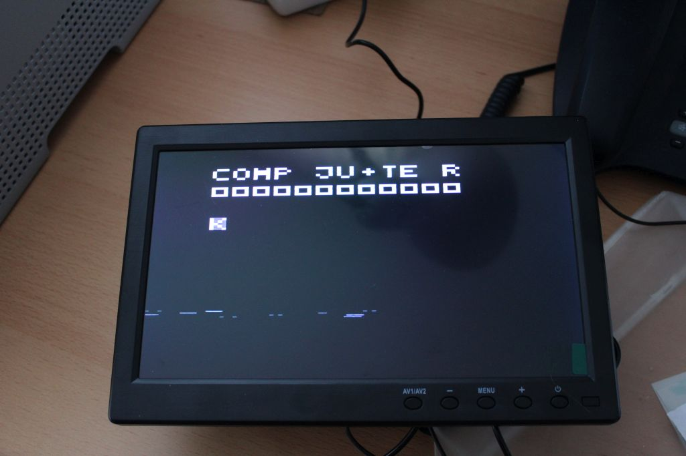
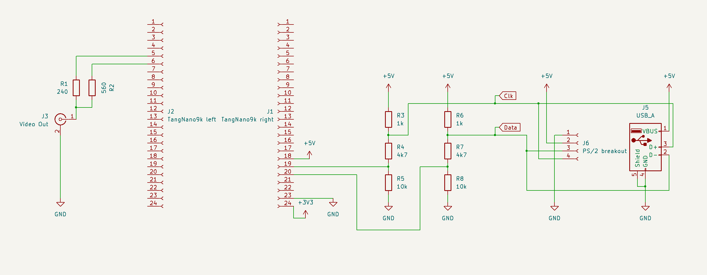

# Z8 Softcore

The project is about implementing a Zilog Z8 microcontroller in Verilog.

So far it already can run the [Tiny computer](https://hc-ddr.hucki.net/wiki/doku.php/tiny):

on a Tang Tano 9k:

## State of the Z8 Softcore

- [x] implement all operations
  - [x] `nop`
  - [x] carry-flag manipulation operations
  - [x] `srp #IM`
  - [x] single-register ALU operations
    - [x] `xxx R`
    - [x] `xxx IR`
    - [x] `inc r`
  - [x] dual-register ALU operations
    - [x] `xxx r, r`
    - [x] `xxx r, Ir`
    - [x] `xxx R, R`
    - [x] `xxx R, IR`
    - [x] `xxx R, #IM`
    - [x] `xxx IR, #IM`
  - [x] load operations
    - [x] `ld r, #IM`
    - [x] `ld r, R`
    - [x] `ld R, r`
    - [x] `ld r, Ir`
    - [x] `ld Ir, r`
    - [x] `ld R, R`
    - [x] `ld R, IR`
    - [x] `ld IR, R`
    - [x] `ld R, #IM`
    - [x] `ld IR, #IM`
    - [x] `ld r, r(x)`
    - [x] `ld r(x), r`
  - [x] control flow operations
    - [x] `djnz r, RA`
    - [x] `jr cc, RA`
    - [x] `jp cc, DA`
    - [x] `jp IRR`
  - [x] `di`, `ei` (disable/enable interrupt)
  - [x] memory operations
    - [x] `ldc r, Irr`
    - [x] `ldc Irr, r`
    - [x] `ldci Ir, Irr`
    - [x] `ldci Irr, Ir`
    - [x] let `lde`/`ldei` work the same as `ldc`/`ldci`
  - [x] stack operations
    - [x] internal stack
      - [x] `pop R`
      - [x] `pop IR`
      - [x] `push R`
      - [x] `push IR`
      - [x] `call IRR`
      - [x] `call DA`
      - [x] `ret`
      - [x] `iret`
    - [x] external stack
  - [x] illegal instruction handling (stop at that address)
- [ ] port 2
  - [ ] input
  - [x] output
- [ ] port 3
  - [ ] P30-P33 generic input
  - [x] P34-P37 generic output
  - [ ] special counter/serial input/output
- [ ] Timers/Counters
  - [x] basics
  - [ ] special external modes
  - [ ] UART
    - [x] basics
    - [ ] parity handling
- [ ] interrupt handling
  - [x] basics (launching the right interrupt)
  - [ ] handle priorities
